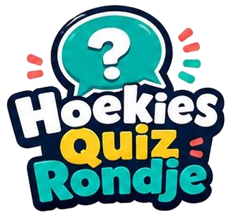

<div align="center">
  

  # Hoekies Quiz Rondje

  De nostalgische borrelquiz voor vrienden — een real-time, multiplayer quizspel in Kahoot-stijl.

  [](https://nextjs.org)
  [](https://firebase.google.com)
  [](https://hoekies-quiz-rondje.vercel.app)
</div>

---

## Over het project

Hoekies Quiz Rondje is een zelf-gehoste quizapp waarmee een host (admin) live quizzen leidt en spelers via hun telefoon meedoen. Spelers scannen een QR-code of openen een link, voeren hun naam in, en beantwoorden vragen in real-time. Hoe sneller je antwoordt, hoe meer punten — met een live leaderboard en een feestelijk winnaarsscherm.

**Live:** [hoekies-quiz-rondje.vercel.app](https://hoekies-quiz-rondje.vercel.app)

## Functies

- **Real-time synchronisatie** — vragen verschijnen direct op alle telefoons via Firestore listeners
- **10 vraagtypen** — meerkeuze, waar/niet-waar, afbeelding, audio, video, raad-het-lied, vervagend beeld, afbeelding-als-antwoord, schatting (slider) en koppelen (match)
- **Snelheidsgebaseerde punten** — sneller antwoorden levert meer punten op, met bonusvragen voor dubbele punten
- **Sessiebeheer** — meerdere sessies in concept, één tegelijk actief, activeren/deactiveren via toggle
- **QR-code & WhatsApp** — spelers uitnodigen via QR of een instelbaar WhatsApp-bericht
- **Thema** — eigen vierkant logo (met crop) en achtergrondafbeelding uploaden
- **Standaard quizzen** — 3 kant-en-klare quizzen (Sport, Algemene Kennis, Muziek — jaren 90/2000)
- **CSV import/export** — vragen in bulk beheren via Excel
- **Live leaderboard** op het admin-dashboard, plus presentatiescherm voor een beamer
- **Winnaarsscherm** met confetti

## Tech stack

| Onderdeel | Technologie |
|---|---|
| Framework | Next.js 16 (App Router, Turbopack) |
| UI | React 19, CSS (glass-morphism) |
| Database | Firebase Firestore (regio `eur3`) |
| Auth | Firebase Authentication |
| Opslag | Firebase Storage (logo + achtergrond) |
| Hosting | Vercel |
| Beeldbewerking | react-image-crop |
| QR-codes | qrcode |

## Aan de slag

### Vereisten

- Node.js 20+
- Een Firebase-project met Firestore, Authentication en Storage ingeschakeld

### Installatie

```bash
git clone https://github.com/Hoekies/hoekies-quiz-rondje.git
cd hoekies-quiz-rondje
npm install
```

### Omgevingsvariabelen

Kopieer `.env.local.example` naar `.env.local` en vul de Firebase-gegevens in:

```bash
cp .env.local.example .env.local
```

```env
# Firebase client (publiek)
NEXT_PUBLIC_FIREBASE_API_KEY=
NEXT_PUBLIC_FIREBASE_AUTH_DOMAIN=
NEXT_PUBLIC_FIREBASE_PROJECT_ID=
NEXT_PUBLIC_FIREBASE_STORAGE_BUCKET=
NEXT_PUBLIC_FIREBASE_MESSAGING_SENDER_ID=
NEXT_PUBLIC_FIREBASE_APP_ID=

# Firebase Admin SDK (server-side, geheim)
FIREBASE_PROJECT_ID=
FIREBASE_CLIENT_EMAIL=
FIREBASE_PRIVATE_KEY=
```

> De `FIREBASE_PRIVATE_KEY` haal je uit een Firebase service-account JSON. Houd deze geheim.

### Firebase rules deployen

```bash
firebase deploy --only firestore:rules,storage --project <jouw-project-id>
```

### Admin-rol toekennen

Admins worden herkend aan de custom claim `rol: "admin"`. Ken deze toe via de Firebase Admin SDK:

```js
await admin.auth().setCustomUserClaims(uid, { rol: "admin" });
```

### Ontwikkelserver

```bash
npm run dev
```

Open [http://localhost:3000](http://localhost:3000).

## Routes

| Route | Beschrijving |
|---|---|
| `/admin` | Dashboard — sessies beheren, live leaderboard |
| `/admin/login` | Inloggen voor de host |
| `/admin/quiz` | Vragen beheren (CRUD + CSV) |
| `/admin/quiz/vraag` | Vraag aanmaken/bewerken |
| `/admin/thema` | Logo + achtergrond uploaden |
| `/admin/instellingen` | WhatsApp-uitnodigingstekst |
| `/admin/handleiding` | Online handleiding |
| `/admin/sessie/[code]` | Live sessiebesturing |
| `/speel/[code]` | Spelerscherm |
| `/presentatie/[code]` | Presentatiescherm (beamer) |
| `/qr/[code]` | QR-code op volledig scherm |
| `/instructies` | Speler-instructies |

## Documentatie

- [Handleiding voor admins](HANDLEIDING_ADMIN.md)
- [Instructies voor spelers](INSTRUCTIES_SPELER.md)

## Puntensysteem

| Situatie | Punten |
|---|---|
| Goed antwoord (basis) | 100 |
| Snelheidsbonus (max) | +50 |
| Bonusvraag (dubbele punten) | × 2 |
| Schatting | naar nabijheid van het juiste getal |
| Fout antwoord | 0 |

## Projectstructuur

```
src/app/
├── admin/              # Beheerpaneel (host)
│   ├── sessie/[code]/  # Live sessiebesturing
│   ├── quiz/           # Vraagbeheer
│   ├── thema/          # Logo + achtergrond
│   └── instellingen/   # WhatsApp-tekst
├── speel/[code]/       # Spelerscherm
├── presentatie/[code]/ # Beamerscherm
├── qr/[code]/          # QR fullscreen
├── instructies/        # Speler-uitleg
└── api/                # Server-side routes (host + speler)
lib/                    # Firebase client + admin config
types/                  # TypeScript types
```

---

<div align="center">
  <sub>Design Hoekies 2026</sub>
</div>
